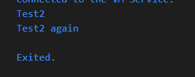
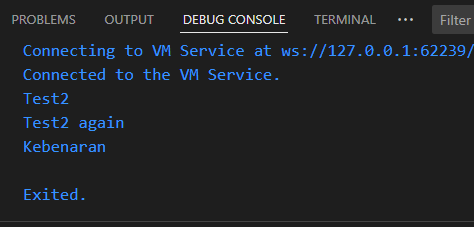
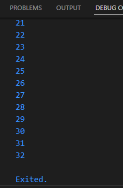
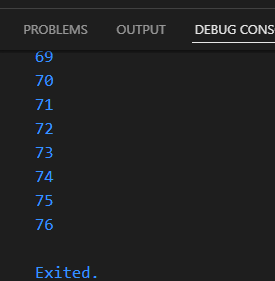
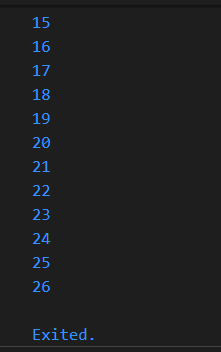
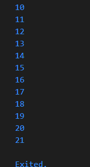
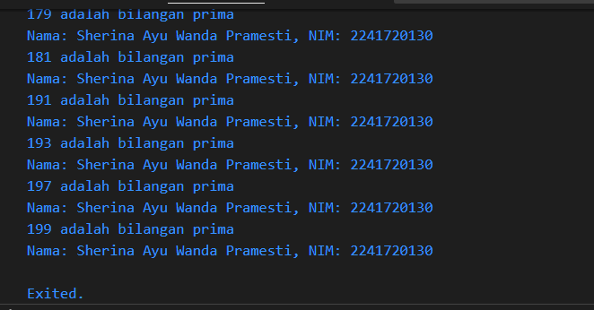

Nama : Sherina Ayu Wanda P.
Kelas : TI-3G
NIM : 2241720130

1. Silakan selesaikan Praktikum 1 sampai 3, lalu dokumentasikan berupa screenshot hasil pekerjaan beserta penjelasannya!
Praktikum 1 Menerapkan Control Flows ("if/else")
Langkah 1:
void main() {
  String test = "test2";

  if (test == "test1") {
    print("Test1");
  } else if (test == "test2") {
    print("Test2");
  } else {
    print("Something else");
  }

  if (test == "test2") print("Test2 again");
}
Langkah 2:
Output:

Penjelasan:
String test = test2, maka ketika di jalankan akan keluar output test 2 dan test2 again karena nilai dari test adalah test2.
Langkah 3:
void main() {
  String test = "test2";

  if (test == "test1") {
    print("Test1");
  } else if (test == "test2") {
    print("Test2");
  } else {
    print("Something else");
  }

  if (test == "test2") print("Test2 again");

  String isTrue = "true"; 
  if (isTrue == "true") {
    print("Kebenaran");
  }
}

Output:

Penjelasan:
String test = test2, maka ketika di jalankan akan keluar output test 2 dan test2 again karena nilai dari test adalah test2. Lalu, variabel isTrue berisi teks "true". Maka, program akan mencetak "Kebenaran"

Praktikum 2: Menerapkan Perulangan "while" dan "do-while"
Langkah 1:
void main() {
  int counter = 0;
  while (counter < 33) {
    print(counter);
    counter++;
  }
  
}
Langkah 2:
Output:

Penjelasan:
Kode ini digunakan untuk menampilkan perulangan, dimisalkan jika counter=0, maka output dimulai dari 0 sampai dengan 32. Ketika menggunakan while, maka kondisi diperiksa sebelum eksekusi.

Langkah 3:
void main() {
  int counter = 0;
  while (counter < 33) {
    print(counter);
    counter++;
  }
  do {
    print(counter);
    counter++;
  } while (counter < 77);
}
Output:

Penjelasan:
Ketika menggunakan do while, maka kondisi diperiksa setelah eksekusi. Jadi, outpunya dimulai dari 0 sampai 76. Cocok digunakan untuk blok kode dieksekusi setidaknya sekali, terlepas dari kondisi awal.

Praktikum 3: Menerapkan Perulangan "for" dan "break-continue"
Langkah 1:
void main() {
  for (int index = 10; index < 27; index++) {
    print(index);
  }
}
Langkah 2:
Output:

Penjelasan:
Kode tersebut digunakan untuk menampilkan perulangan. Jadi, outputnya index dimulai dari 10 sampai dengan 26. index++ mengindikasikan bahwa index dimulai dari 10 + 1, dan seterusnya sampai dengan batas index.

Langkah 3:
void main() {
  for (int index = 10; index < 27; index++) {
    print(index);
    if (index == 21)
      break;
    else if (index > 1 || index < 7) continue;
    print(index);
  }
}
Output:

Penjelasan:
Terdapat penambahan if else di dalam perulangan. Jadi, jika nilai index=21, maka output berhenti karena terdapat kode break yang bertujuan untuk menghentikan loop secara langsung. Maka dari itu, output dimulai dari 10-21.

2.Buatlah sebuah program yang dapat menampilkan bilangan prima dari angka 0 sampai 201 menggunakan Dart. Ketika bilangan prima ditemukan, maka tampilkan nama lengkap dan NIM Anda.
void main() {
  String nama = "Sherina Ayu Wanda Pramesti";
  String nim = "2241720130";

  // Fungsi untuk memeriksa apakah bilangan itu prima
  bool isPrime(int num) {
    if (num < 2) return false;
    for (int i = 2; i <= num ~/ 2; i++) {
      if (num % i == 0) return false;
    }
    return true;
  }

  // Menampilkan bilangan prima dari 0 sampai 201
  for (int i = 0; i <= 201; i++) {
    if (isPrime(i)) {
      print('$i adalah bilangan prima');
      print('Nama: $nama, NIM: $nim');
    }
  }
}
Output:

