1. Praktikum 1: Eksperimen Tipe Data List
1.
void main() {
  var list = [1, 2, 3];
  assert(list.length == 3);
  assert(list[1] == 2);
  print(list.length);
  print(list[1]);

  list[1] = 1;
  assert(list[1] == 1);
  print(list[1]);
}
2.
Output:
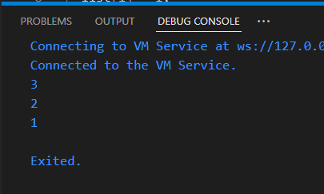
Penjelasan:
Melakukan pengecekan kondisi tertentu. Jika kondisi tidak terpenuhi, maka akan terjadi pengecualian (exception) yang akan menghentikan eksekusi program.

3.
void main() {
  final list = List<Object?>.filled(5, null);  
  list[1] = 'Sherina Ayu';                    // Mengisi elemen ke-1 dengan nama
  list[2] = '2241720130';                     // Mengisi elemen ke-2 dengan NIM

  // Print hasilnya
  print(list);  // Mencetak seluruh list
}
Output:
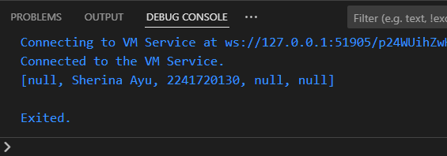
Penjelasan:
Kode tersebut membuat sebuah list dengan panjang 5 elemen yang awalnya berisi nilai null. Kemudian, dua elemen pertama dari list diubah menjadi string yang berisi nama dan NIM. Lalu, seluruh isi list dicetak ke konsol.

Praktikum 2: Eksperimen Tipe Data Set
1.
void main() {
  var halogens = {'fluorine', 'chlorine', 'bromine', 'iodine', 'astatine'};
  print(halogens);
}
2.
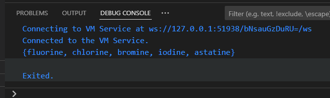
Penjelasan:
Kode tersebut akan mencetak himpunan (set) yang berisi elemen-elemen halogen:
{fluorine, chlorine, bromine, iodine, astatine}

3.
void main() {
  var halogens = {'fluorine', 'chlorine', 'bromine', 'iodine', 'astatine'};
  print(halogens);
  var names1 = <String>{};
  Set<String> names2 = {}; // This works, too.
  var names3 = {}; // Creates a map, not a set.

  print(names1);
  print(names2);
  print(names3);
}
Output:
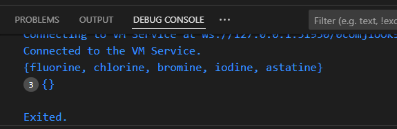
Tambahkan elemen nama dan NIM Anda pada kedua variabel Set tersebut dengan dua fungsi berbeda yaitu .add() dan .addAll()
var halogens = {'fluorine', 'chlorine', 'bromine', 'iodine', 'astatine'};
  print(halogens);

  var names1 = <String>{}; // Set kosong
  Set<String> names2 = {}; // Set kosong juga
  var names3 = {}; // Membuat map, bukan set

  // Menggunakan .add() untuk menambahkan elemen satu per satu
  names1.add('Sherina Ayu');
  names1.add('2241720130');

  // Menggunakan .addAll() untuk menambahkan elemen sekaligus
  names2.addAll({'Sherina Ayu', '2241720130'});

  print(names1); // Output: {Sherina Ayu, 2241720130}
  print(names2); // Output: {Sherina Ayu, 2241720130}
  print(names3); // Output: {} (Map kosong)
Output:
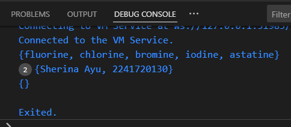
Penjelasan:
.add(): Metode ini digunakan untuk menambahkan satu elemen ke dalam himpunan.
.addAll(): Metode ini digunakan untuk menambahkan beberapa elemen sekaligus dari himpunan lain ke dalam himpunan yang sedang diubah. 
Outputnya names1 dan names2 berisi himpunan yang sama, yaitu {'Sherina Ayu', '2241720130'}, sedangkan names3 adalah sebuah map kosong.

Praktikum 3: Eksperimen Tipe Data Maps
1.
void main() {
  var gifts = {
    // Key:    Value
    'first': 'partridge',
    'second': 'turtledoves',
    'fifth': 1
  };

  var nobleGases = {
    2: 'helium',
    10: 'neon',
    18: 2,
  };

  print(gifts);
  print(nobleGases);
}
2.
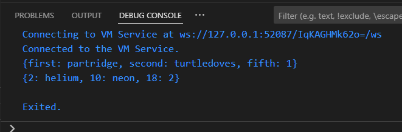
Penjelasan:
var gifts = {...};: Membuat sebuah map bernama gifts yang menyimpan pasangan kunci-nilai. Kunci-kunci dalam map ini adalah string, sedangkan nilai-nilainya adalah campuran string dan integer.
var nobleGases = {...};: Membuat sebuah map bernama nobleGases yang juga menyimpan pasangan kunci-nilai. Kunci-kunci dalam map ini adalah integer, sedangkan nilai-nilainya adalah string.
print(gifts); dan print(nobleGases);: Mencetak isi kedua map tersebut ke konsol.

3.
void main() {
  var gifts = {
    // Key:    Value
    'first': 'partridge',
    'second': 'turtledoves',
    'fifth': 1
  };

  var nobleGases = {
    2: 'helium',
    10: 'neon',
    18: 2,
  };

  print(gifts);
  print(nobleGases);
  var mhs1 = Map<String, String>();
  gifts['first'] = 'partridge';
  gifts['second'] = 'turtledoves';
  gifts['fifth'] = 'golden rings';

  var mhs2 = Map<int, String>();
  nobleGases[2] = 'helium';
  nobleGases[10] = 'neon';
  nobleGases[18] = 'argon';
}
Output:
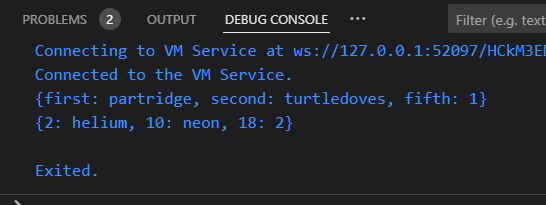
Penjelasan:
Kode ini menunjukkan cara membuat dan memanipulasi map dalam bahasa Dart. Map dapat digunakan untuk menyimpan pasangan kunci-nilai yang dapat diakses menggunakan kunci.

Tambahkan elemen nama dan NIM Anda pada tiap variabel di atas (gifts, nobleGases, mhs1, dan mhs2).
var gifts = {
    // Key:    Value
    'first': 'partridge',
    'second': 'turtledoves',
    'fifth': 'golden rings',
    'name': 'Sherina Ayu',
    'NIM': '2241720130'
  };

  var nobleGases = {
    2: 'helium',
    10: 'neon',
    18: 'argon',
    101: 'Sherina Ayu',
    102: '2241720130'
  };

  var mhs1 = Map<String, String>();
  gifts['first'] = 'partridge';
  gifts['second'] = 'turtledoves';
  gifts['fifth'] = 'golden rings';
  gifts['name'] = 'Sherina Ayu';
  gifts['NIM'] = '2241720130';

  var mhs2 = Map<int, String>();
  nobleGases[2] = 'helium';
  nobleGases[10] = 'neon';
  nobleGases[18] = 'argon';
  nobleGases[101] = 'Sherina Ayu';
  nobleGases[102] = '2241720130';

  print(gifts);
  print(nobleGases);

  Output:
  

Praktikum 4: Eksperimen Tipe Data List: Spread dan Control-flow Operators
1.
void main() {
  var list1 = [1, 2, 3];
  var list2 = [0, ...list1];
  print(list1);
  print(list2);
  print(list2.length);
}
2.
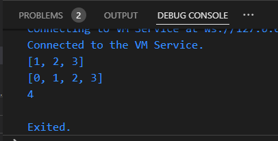
Penjelasan:
List list1 tetap berisi elemen-elemen aslinya, sedangkan list list2 adalah sebuah list baru yang berisi elemen 0 diikuti oleh semua elemen dari list list1. Panjang list list2 adalah 4 karena terdapat empat elemen.

3.
void main() {
  var list1 = <int?>[1, 2, 3]; // <int?> mengizinkan elemen null
  var list2 = [0, ...list1];
  print(list1);
  print(list2);
  print(list2.length);
  list1 = [1, 2, null];
  print(list1);
  var list3 = [0, ...?list1];
  print(list3.length);
}
Output:
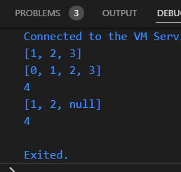
Tambahkan variabel list berisi NIM Anda menggunakan Spread Operators. Dokumentasikan hasilnya dan buat laporannya!
var nim = [2, 2, 4, 1, 7, 2, 0, 1, 3, 0];
  var listWithNim = [0, ...nim];
  print(listWithNim);
  print(listWithNim.length);
Output:
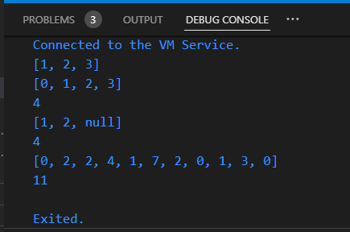
4.
var promoActive = true;
  var nav = ['Home', 'Furniture', 'Plants', if (promoActive) 'Outlet'];
  print(nav);
  promoActive = false;
  nav = ['Home', 'Furniture', 'Plants', if (promoActive) 'Outlet'];
  print(nav);
Tunjukkan hasilnya jika variabel promoActive ketika true dan false.
Output:
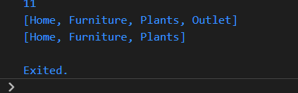
5.
var login = 'Manager';
  var nav2 = [
    'Home',
    'Furniture',
    'Plants',
    if (login == 'Manager') 'Inventory'
  ];
  print(nav2);
Output:
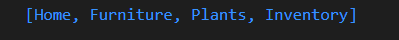
6.
print(nav2);
  var listOfInts = [1, 2, 3];
  var listOfStrings = ['#0', for (var i in listOfInts) '#$i'];
  assert(listOfStrings[1] == '#1');
  print(listOfStrings);
Output:
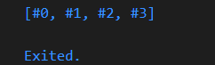
Penjelasan:
Collection for adalah sebuah fitur dalam bahasa Dart yang memungkinkan untuk membuat list atau set baru dengan elemen-elemen yang dihasilkan dari ekspresi untuk setiap elemen dalam koleksi yang ada. Hal ini sangat berguna untuk menghasilkan list atau set baru berdasarkan kondisi tertentu atau untuk melakukan transformasi pada elemen-elemen dalam koleksi yang ada.
-Membuat list atau set baru dengan elemen-elemen yang dihasilkan dari ekspresi
-Memfilter elemen-elemen dalam koleksi berdasarkan kondisi tertentu
-Mentransformasi elemen-elemen dalam koleksi
-Menggabungkan elemen-elemen dari beberapa koleksi

Praktikum 5: Eksperimen Tipe Data Records
1.
void main() {
  var record = ('first', a: 2, b: true, 'last');
  print(record);
}
2.
Output:
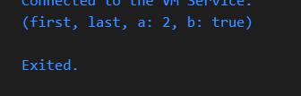
Penjelasan:
var record = ('first', a: 2, b: true, 'last');: Membuat sebuah tuple bernama record yang berisi empat elemen: 'first', a: 2, b: true, dan 'last'. Elemen pertama dan keempat adalah string, sedangkan elemen kedua dan ketiga adalah pasangan kunci-nilai.
print(record);: Mencetak isi tuple record.

3.
void main() {
  var record = ('first', a: 2, b: true, 'last');
  print('Original record: $record');

  // Definisikan fungsi tukar untuk menukar nilai dari tuple
  (int, int) tukar((int, int) record) {
    var (a, b) = record;
    return (b, a);
  }

  // Membuat record untuk pertukaran
  var tuple = (1, 2);
  var swapped = tukar(tuple);
  print('Original tuple: $tuple');
  print('Swapped tuple: $swapped');

  // Untuk mendemonstrasikan penggunaan record lebih lanjut
  print('Record with named fields: ${record}');
}
Output:
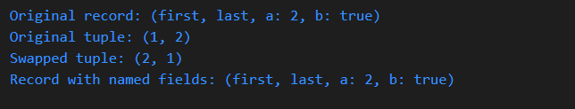
4.
(String, int) mahasiswa = ('Sherina Ayu', 2241720130);
  print(mahasiswa);
Output:
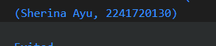
5.
var mahasiswa2 = ('first', a: 2, b: true, 'last');

  print(mahasiswa2.$1); // Prints 'first'
  print(mahasiswa2.a); // Prints 2
  print(mahasiswa2.b); // Prints true
  print(mahasiswa2.$2); // Prints 'last'
Output:
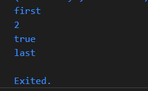
Gantilah salah satu isi record dengan nama dan NIM Anda, lalu dokumentasikan hasilnya dan buat laporannya!
var mahasiswa2 = ('Sherina Ayu', a: 2, b: true, '2241720130');

  print(mahasiswa2.$1); // Prints 'first'
  print(mahasiswa2.a); // Prints 2
  print(mahasiswa2.b); // Prints true
  print(mahasiswa2.$2); // Prints 'last'
Output:
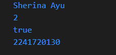

Tugas Praktikum
1.Silakan selesaikan Praktikum 1 sampai 5, lalu dokumentasikan berupa screenshot hasil pekerjaan Anda beserta penjelasannya!
2.Jelaskan yang dimaksud Functions dalam bahasa Dart!
Fungsi dalam bahasa pemrograman Dart adalah sebuah blok kode yang dirancang untuk melakukan tugas tertentu. Fungsi ini dapat dipanggil berulang kali tanpa harus menulis ulang kode yang sama. Dengan menggunakan fungsi, dapat membuat kode menjadi lebih terstruktur, mudah dibaca, dan lebih mudah dipelihara.
Jenis-Jenis Fungsi
Fungsi tanpa nilai kembalian: Fungsi dengan tipe kembalian void, biasanya digunakan untuk melakukan suatu tindakan tanpa menghasilkan nilai.
Fungsi dengan nilai kembalian: Fungsi yang mengembalikan nilai hasil pemrosesan, tipe kembaliannya bisa berupa int, double, String, atau tipe data lainnya.
Fungsi anonim (lambda expression): Fungsi yang tidak memiliki nama, sering digunakan sebagai parameter fungsi lain atau sebagai nilai variabel.
Fungsi rekursif: Fungsi yang memanggil dirinya sendiri, digunakan untuk menyelesaikan masalah yang dapat dipecah menjadi submasalah yang lebih kecil.

3.Jelaskan jenis-jenis parameter di Functions beserta contoh sintaksnya!
-Required Parameters: Parameter yang harus selalu diberikan nilai saat memanggil fungsi.
Contoh:
int jumlahkan(int a, int b) {
    return a * b;
}
-Optional Positional Parameters: Parameter yang boleh diberikan nilai atau tidak. Posisi parameter ini harus sesuai dengan urutan yang telah ditentukan.
Contoh:
void cetakNama(String namaDepan, [String namaBelakang]) {
    if (namaBelakang != null) {
        print('Nama lengkap: $namaDepan $namaBelakang');
    } else {
        print('Nama depan: $namaDepan');
    }
}
-Optional Named Parameters: Parameter yang boleh diberikan nilai atau tidak, dan urutannya tidak penting. Saat memberikan nilai, kita harus menyebutkan nama parameternya.
Contoh:
void cetakProfil(String nama, {int usia, String pekerjaan}) {
    print('Nama: $nama');
    if (usia != null) {
        print('Usia: $usia');
    }
    if (pekerjaan != null) {
        print('Pekerjaan: $pekerjaan');
    }
}
-Default Parameter Values: Parameter yang memiliki nilai default jika tidak diberikan nilai saat pemanggilan fungsi.
Contoh:
void sapa(String nama, {int usia = 20}) {
    print('Halo, $nama! Usia Anda: $usia');
}

4.Jelaskan maksud Functions sebagai first-class objects beserta contoh sintaknya!
Fungsi Kelas Pertama
Dalam bahasa pemrograman Dart, fungsi diperlakukan sebagai objek kelas pertama. Ini berarti fungsi memiliki karakteristik yang sama seperti objek lainnya:

-Dapat disimpan dalam variabel: Fungsi dapat ditugaskan ke sebuah variabel.
-Dapat dilewatkan sebagai argumen ke fungsi lain: Fungsi dapat menjadi parameter dari fungsi lainnya.
-Dapat dikembalikan sebagai nilai dari sebuah fungsi: Fungsi dapat menjadi nilai kembalian dari fungsi lain.
Contoh:
// Menyimpan fungsi dalam variabel
void sayHello(String name) {
  print('Hello, $name!');
}

var greet = sayHello;
greet('John'); // Output: Hello, John!

// Melewatkan fungsi sebagai argumen
void executeFunction(Function func) {
  func();
}

executeFunction(sayHello); // Memanggil fungsi sayHello

// Mengembalikan fungsi dari fungsi lain
Function createGreeter(String prefix) {
  return (String name) {
    print('$prefix, $name!');
  };
}

var formalGreeter = createGreeter('Good day');
formalGreeter('Alice'); // Output: Good day, Alice!
Menyimpan Fungsi dalam Variabel:
-Variabel greet sekarang merujuk ke fungsi sayHello. Ketika greet dipanggil, sebenarnya fungsi sayHello yang dieksekusi.
Melewatkan Fungsi sebagai Argumen:
-Fungsi executeFunction menerima sebuah fungsi sebagai parameter. Ketika kita memanggil executeFunction dengan sayHello, fungsi sayHello akan dieksekusi di dalam tubuh executeFunction.
Mengembalikan Fungsi dari Fungsi Lain:
-Fungsi createGreeter mengembalikan sebuah fungsi anonim. Fungsi anonim ini menerima satu parameter (name) dan mencetak pesan sapaan dengan awalan yang ditentukan oleh parameter prefix dari createGreeter.

5.Apa itu Anonymous Functions? Jelaskan dan berikan contohnya!
Fungsi anonim adalah sebuah fungsi yang tidak memiliki nama. Fungsi ini sering kali digunakan sebagai parameter untuk fungsi lain, atau sebagai nilai yang ditugaskan ke variabel. Karena tidak memiliki nama, fungsi anonim sering disebut juga sebagai lambda expression.

Contoh:
// Fungsi anonim sebagai parameter untuk forEach
var numbers = [1, 2, 3, 4, 5];
numbers.forEach((number) {
  print(number * 2);
});

// Fungsi anonim sebagai nilai yang ditugaskan ke variabel
var greet = (String name) {
  print('Hello, $name!');
};
greet('John');

// Fungsi anonim sebagai hasil dari fungsi lain
Function createGreeter(String prefix) {
  return (String name) {
    print('$prefix, $name!');
  };
}
var formalGreeter = createGreeter('Good day');
formalGreeter('Alice');
Penjelasan Contoh:
-forEach: Fungsi forEach pada list menerima sebuah fungsi anonim sebagai parameter. Fungsi anonim ini akan dieksekusi untuk setiap elemen dalam list.
-Variabel greet: Variabel greet menyimpan sebuah fungsi anonim yang menerima satu parameter name.
-Fungsi createGreeter: Fungsi ini mengembalikan sebuah fungsi anonim yang telah "menutup" nilai prefix. Fungsi anonim yang dikembalikan ini kemudian dapat digunakan untuk mencetak pesan sapaan dengan awalan yang telah ditentukan.

6.Jelaskan perbedaan Lexical scope dan Lexical closures! Berikan contohnya!
Lexical scope mengacu pada aturan di mana variabel dapat diakses dalam suatu blok kode. Dalam Dart, scope sebuah variabel ditentukan oleh letak kurung kurawal ({}) di mana variabel tersebut dideklarasikan. Variabel yang dideklarasikan di dalam suatu blok hanya dapat diakses di dalam blok tersebut dan blok-blok anak di dalamnya.
Contoh:
void main() {
  var message = "Hello"; // Variabel dengan scope global dalam fungsi main

  if (true) {
    var name = "World"; // Variabel dengan scope lokal dalam blok if
    print("$message, $name!"); // Output: Hello, World!
  }

  // print(name); // Ini akan menyebabkan error karena name hanya ada di dalam blok if
}

Lexical closure adalah sebuah fungsi yang memiliki akses ke variabel-variabel yang berada di luar scope-nya (scope leksikalnya), bahkan setelah fungsi tersebut dipanggil dari luar scope asalnya. Ini terjadi karena fungsi tersebut "menutup" (closure) variabel-variabel tersebut.
Contoh:
Function createGreeter(String prefix) {
  var greeting = "$prefix, "; // Variabel greeting "ditutup" oleh fungsi

  return (String name) {
    print(greeting + name);
  };
}

var formalGreeter = createGreeter("Good day");
formalGreeter("Alice"); // Output: Good day, Alice
Lexical scope adalah tentang di mana variabel dapat dilihat.
Lexical closure adalah tentang bagaimana fungsi "mengingat" variabel dari lingkungan di mana ia dibuat, bahkan setelah fungsi tersebut dipindahkan ke tempat lain.

7.Jelaskan dengan contoh cara membuat return multiple value di Functions!
Mengembalikan Beberapa Nilai dalam Fungsi Dart. Misalnya, saat ingin menghitung luas dan keliling sebuah lingkaran, bisa membuat sebuah fungsi yang mengembalikan kedua nilai tersebut sekaligus.
Contoh:
Mengembalikan List
List<num> hitungLingkaran(num jariJari) {
  num luas = 3.14 * jariJari * jariJari;
  num keliling = 2 * 3.14 * jariJari;
  return [luas, keliling];
}

void main() {
  List<num> hasil = hitungLingkaran(5);
  print("Luas: ${hasil[0]}");
  print("Keliling: ${hasil[1]}");
}

8.Kumpulkan berupa link commit repo GitHub pada tautan yang telah disediakan di grup Telegram!

