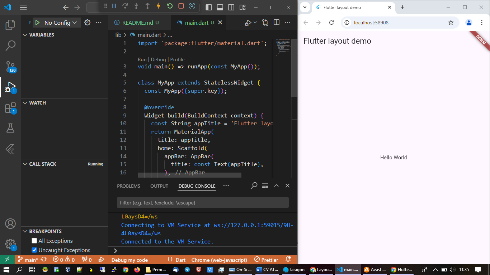
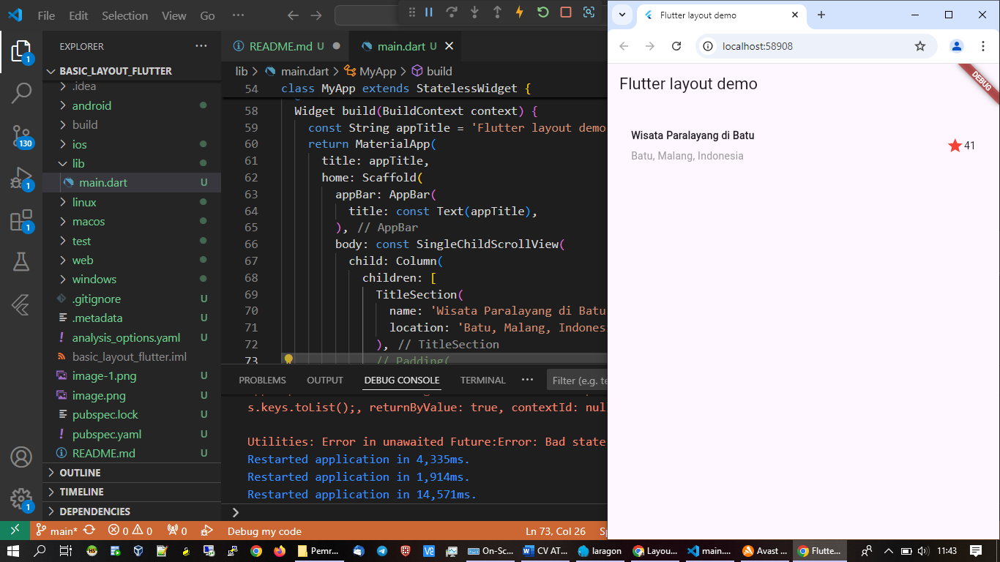
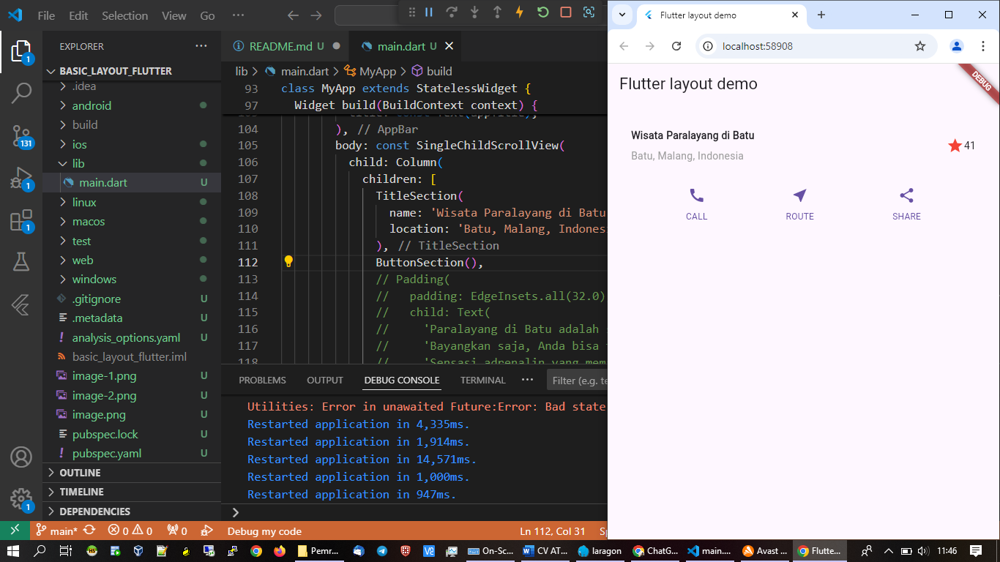
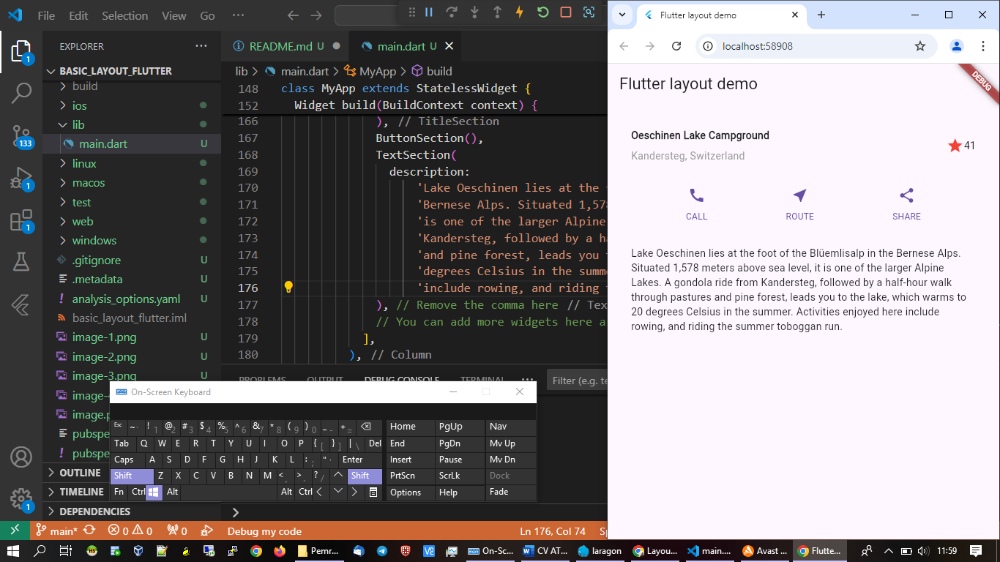
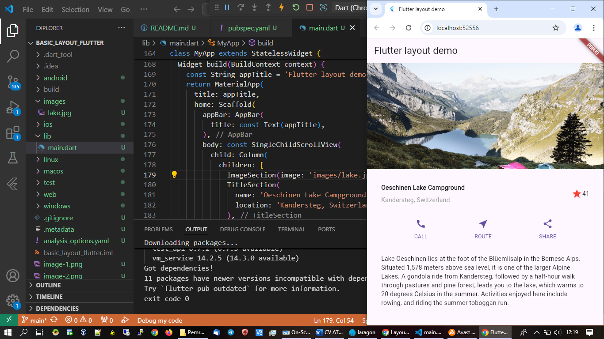

Build a Flutter layout
Create the app base code
In this section, shell out the basic Flutter app code to start your app.

1.Set up your Flutter environment.
2.Create a new Flutter app.
3.Replace the contents of lib/main.dart with the following code. This app uses a parameter for the app title and the title shown on the app's appBar. This decision simplifies the code.

Add the TitleSection Widget

Change the app body to a scrolling view

Update the app to display the title section

Add the Button section

Add the Text section

Add the Image section

