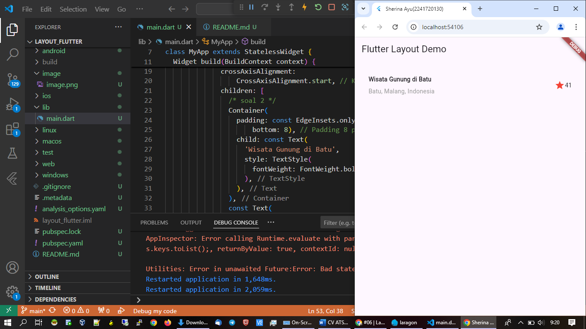
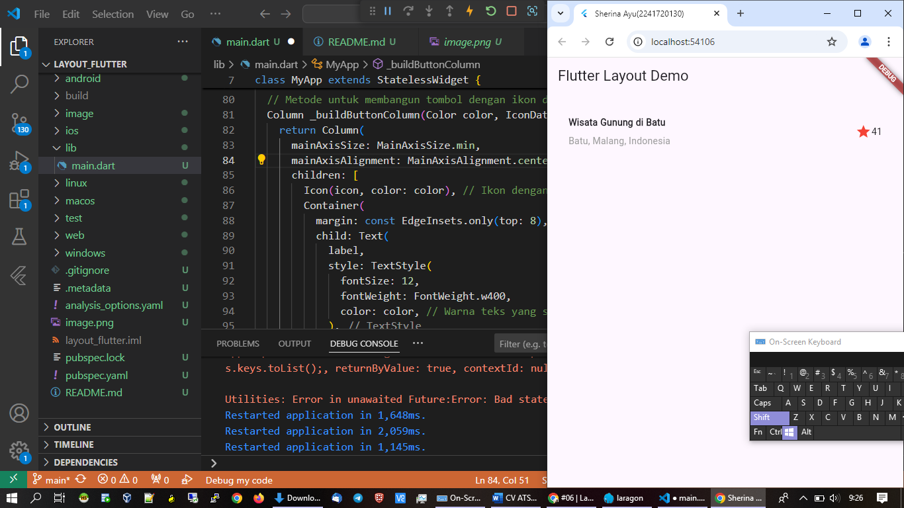
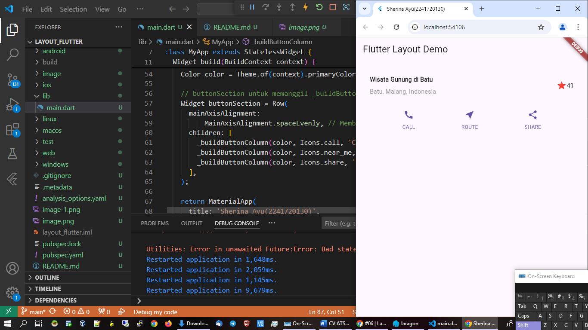
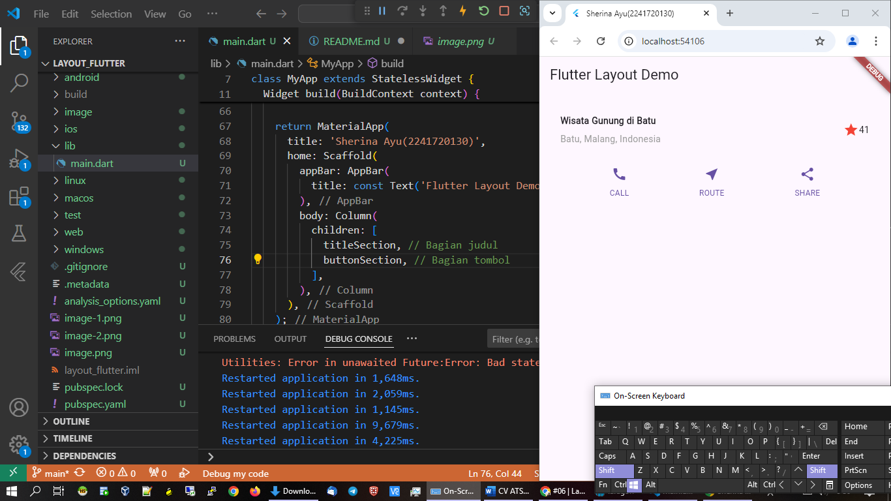
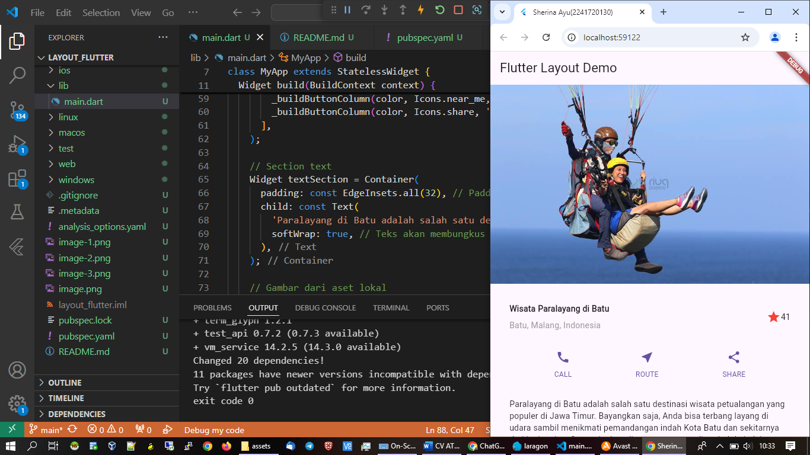
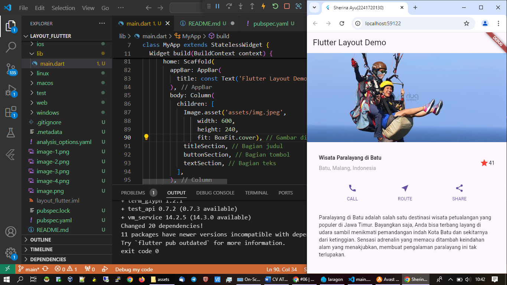
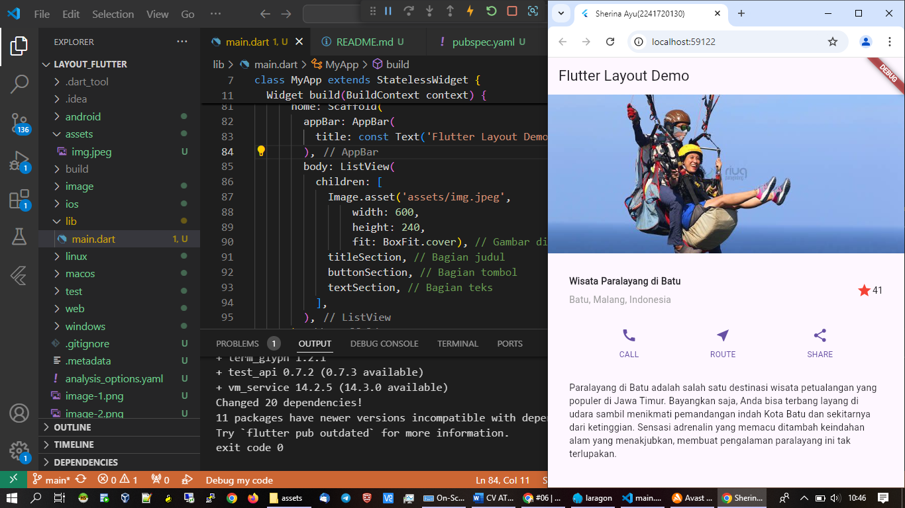

# layout_flutter
Praktikum 1: Membangun Layout di Flutter
Langkah 1: Buat Project Baru
Langkah 2: Buka file lib/main.dart

Langkah 3: Identifikasi layout diagram
Langkah pertama adalah memecah tata letak menjadi elemen dasarnya:

Identifikasi baris dan kolom.
Apakah tata letaknya menyertakan kisi-kisi (grid)?
Apakah ada elemen yang tumpang tindih?
Apakah UI memerlukan tab?
Perhatikan area yang memerlukan alignment, padding, atau borders.

Langkah 4: Implementasi title row

Penjelasan dari perubahan:

soal 1: Widget Column dimasukkan ke dalam widget Expanded dan ditambahkan properti crossAxisAlignment: CrossAxisAlignment.start.
soal 2: Teks 'Wisata Gunung di Batu' dibungkus dalam Container dengan padding: EdgeInsets.only(bottom: 8). Teks kedua diberi warna abu-abu.
soal 3: Ikon bintang diikuti dengan teks '41'. Ikon bintang diatur dengan warna merah, dan padding di seluruh Container sebesar 32.

Praktikum 2: Implementasi button row
Langkah 1: Buat method Column _buildButtonColumn

Langkah 2: Buat widget buttonSection
 
Langkah 3: Tambah button section ke body

Praktikum 3: Implementasi text section
Langkah 1: Buat widget textSection
Langkah 2: Tambahkan variabel text section ke body

Praktikum 4: Implementasi image section
Langkah 1: Siapkan aset gambar
Langkah 2: Tambahkan gambar ke body
 body: Column(
          children: [
            Image.asset('assets/img.jpeg',
                width: 600,
                height: 240,
                fit: BoxFit.cover), // Gambar di bagian paling atas
            titleSection, // Bagian judul
            buttonSection, // Bagian tombol
            textSection, // Bagian teks
          ],

Langkah 3: Terakhir, ubah menjadi ListView
body: ListView(
          children: [
            Image.asset('assets/img.jpeg',
                width: 600,
                height: 240,
                fit: BoxFit.cover), // Gambar di bagian paling atas
            titleSection, // Bagian judul
            buttonSection, // Bagian tombol
            textSection, // Bagian teks
          ],

Tugas Praktikum 1
1.Selesaikan Praktikum 1 sampai 4, lalu dokumentasikan dan push ke repository Anda berupa screenshot setiap hasil pekerjaan beserta penjelasannya di file README.md!
2.Silakan implementasikan di project baru "basic_layout_flutter" dengan mengakses sumber ini: https://docs.flutter.dev/codelabs/layout-basics
3.Kumpulkan link commit repository GitHub Anda kepada dosen yang telah disepakati!

