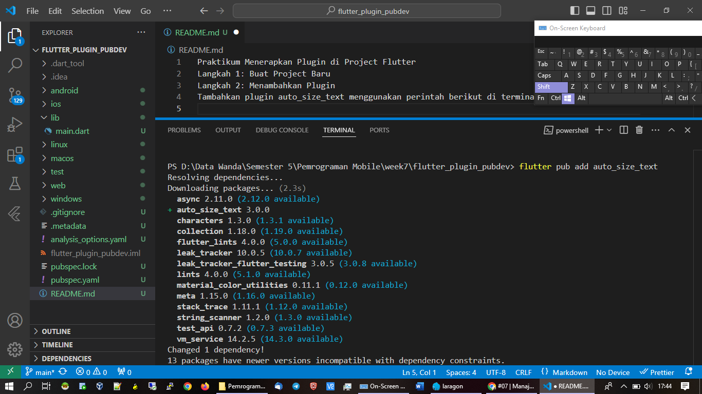
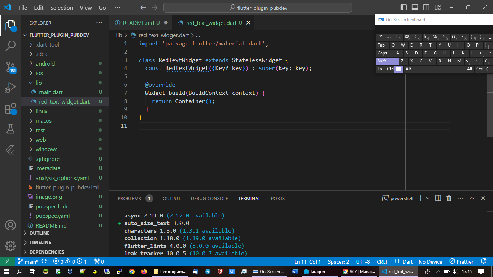
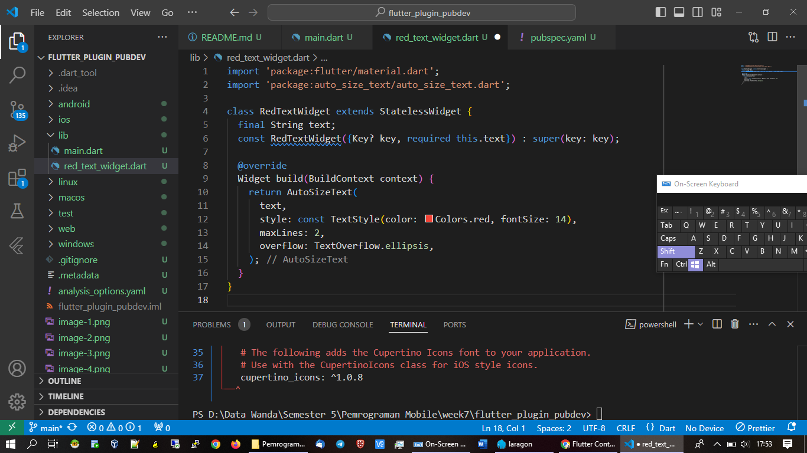
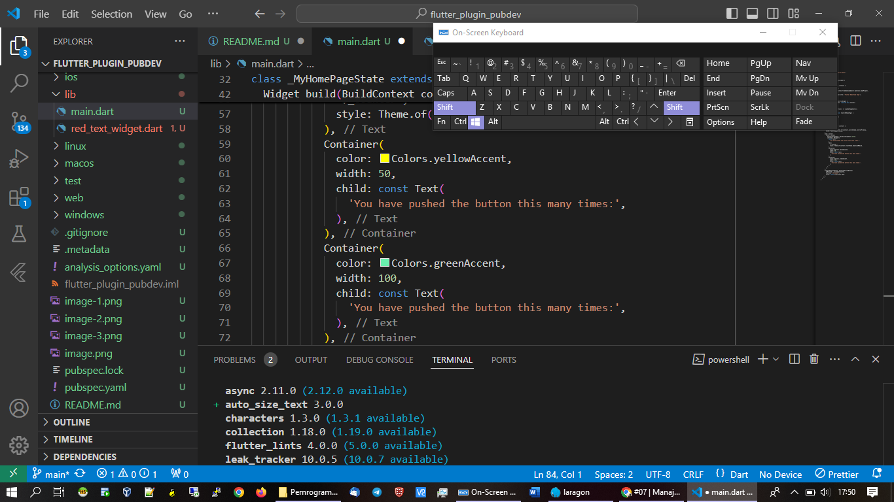
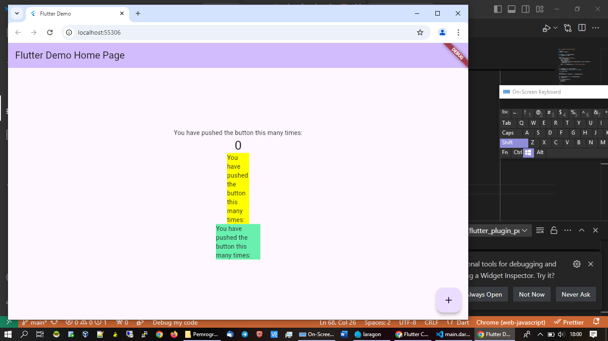

Praktikum Menerapkan Plugin di Project Flutter
Langkah 1: Buat Project Baru
Langkah 2: Menambahkan Plugin
Tambahkan plugin auto_size_text menggunakan perintah berikut di terminal

Langkah 3: Buat file red_text_widget.dart

Langkah 4: Tambah Widget AutoSizeText

Langkah 5: Buat Variabel text dan parameter di constructor

Langkah 6: Tambahkan widget di main.dart

Output:

Tugas Praktikum
1.Selesaikan Praktikum tersebut, lalu dokumentasikan dan push ke repository Anda berupa screenshot hasil pekerjaan beserta penjelasannya di file README.md!
2.Jelaskan maksud dari langkah 2 pada praktikum tersebut!
Pada langkah 2, perintah flutter pub add auto_size_text digunakan untuk menambahkan dependensi plugin auto_size_text ke dalam proyek Flutter.
-flutter pub add auto_size_text adalah perintah yang secara otomatis menambahkan paket auto_size_text ke file pubspec.yaml tanpa harus menambahkan secara manual.
-Plugin auto_size_text digunakan untuk mengatur ukuran teks secara otomatis berdasarkan ruang yang tersedia, memastikan teks tidak melebihi batas yang diizinkan.

3.Jelaskan maksud dari langkah 5 pada praktikum tersebut!
-final String text; adalah deklarasi variabel yang menyimpan teks yang akan ditampilkan dalam widget AutoSizeText. Dengan deklarasi ini, setiap kali widget RedTextWidget dibuat, teksnya bisa disesuaikan sesuai keperluan.
-const RedTextWidget({Key? key, required this.text}) : super(key: key); adalah constructor widget. Parameter required this.text mengharuskan teks tersebut diisi saat widget ini dibuat. super(key: key) adalah cara untuk meneruskan kunci (key) ke superclass (dalam hal ini, StatelessWidget), yang penting untuk identifikasi unik widget dalam tree Flutter.

4.Pada langkah 6 terdapat dua widget yang ditambahkan, jelaskan fungsi dan perbedaannya!
Container pertama:
Container(
   color: Colors.yellowAccent,
   width: 50,
   child: const RedTextWidget(
             text: 'You have pushed the button this many times:',
          ),
),
Fungsi: Menampilkan teks yang diberikan ke RedTextWidget dengan warna teks merah dan ukuran yang disesuaikan secara otomatis oleh AutoSizeText.
Perbedaan: Container ini menggunakan widget kustom RedTextWidget yang menggunakan AutoSizeText untuk menyesuaikan ukuran teks sesuai dengan lebar dan batas-batas yang diberikan.

Container kedua:
Container(
   color: Colors.greenAccent,
   width: 100,
   child: const Text(
          'You have pushed the button this many times:',
         ),
),

Fungsi: Menampilkan teks statis menggunakan widget bawaan Text, tanpa penyesuaian ukuran otomatis.
Perbedaan: Text adalah widget dasar Flutter untuk menampilkan teks, yang tidak menyesuaikan ukuran secara otomatis seperti AutoSizeText. Oleh karena itu, teks yang terlalu panjang mungkin akan terpotong atau meluap di luar container jika tidak cukup ruang.

Perbedaan utama adalah bahwa RedTextWidget menggunakan AutoSizeText untuk menyesuaikan ukuran teks secara otomatis agar pas di dalam lebar container, sementara Text tidak memiliki kemampuan ini.

5.Jelaskan maksud dari tiap parameter yang ada di dalam plugin auto_size_text berdasarkan tautan pada dokumentasi ini !
1.text (String):

Ini adalah parameter utama yang berisi teks yang akan ditampilkan oleh widget AutoSizeText. Teks ini dapat berupa string biasa yang akan dirender dengan ukuran font yang diatur atau disesuaikan berdasarkan ruang yang tersedia.
2.style (TextStyle):

Parameter ini menentukan gaya teks seperti warna, ukuran font, font weight, font family, dan sebagainya. Dengan menggunakan style, kamu bisa mengatur berbagai atribut visual teks.
3.maxLines (int):

Menentukan jumlah maksimum baris yang diizinkan untuk menampilkan teks. Jika teks lebih panjang dari batas ini, maka akan disesuaikan agar tetap berada dalam jumlah baris yang ditentukan.
4.overflow (TextOverflow):

Menentukan bagaimana teks yang meluap akan ditampilkan jika tidak ada cukup ruang. Contohnya:
TextOverflow.clip memotong teks di tepi batas widget.
TextOverflow.ellipsis menampilkan "...".
TextOverflow.fade memudar di akhir teks.
5.minFontSize (double):

Menentukan ukuran font minimum yang diizinkan saat plugin mencoba mengecilkan teks untuk menyesuaikan ke ruang yang tersedia. Jika teks tidak muat dalam batas minFontSize, maka itu akan tetap berada pada ukuran minimum tersebut.
6.maxFontSize (double):

Menentukan ukuran font maksimum yang diizinkan saat menampilkan teks. Ini berguna untuk membatasi teks agar tidak diperbesar lebih dari ukuran yang diinginkan.
7.stepGranularity (double):

Parameter ini menentukan seberapa besar perubahan ukuran font ketika plugin mencoba menyesuaikan teks ke dalam ruang. Misalnya, jika stepGranularity diatur ke 2, ukuran font akan berubah dengan langkah 2 (misalnya 16, 18, 20, dst.) saat mencari ukuran optimal.
8.presetFontSizes (List<double>):

Ini adalah daftar ukuran font yang ditentukan sebelumnya untuk mencoba mencocokkan teks ke dalam ruang. Jika nilai ini diberikan, widget hanya akan mencoba ukuran font dari daftar ini.
9.group (AutoSizeGroup):

Dengan menggunakan AutoSizeGroup, beberapa widget AutoSizeText dapat disinkronkan untuk memiliki ukuran font yang sama. Ini berguna jika ada beberapa teks yang harus ditampilkan dengan ukuran yang seragam di beberapa widget, terlepas dari ruang yang tersedia masing-masing.
10.wrapWords (bool):

Mengatur apakah teks akan membungkus kata. Jika diatur ke false, teks akan mencoba menyesuaikan ukuran tanpa membungkus kata dan akan mengecilkan seluruh teks sekaligus.
11.overflowReplacement (Widget):

Jika teks tidak dapat ditampilkan dalam ruang yang tersedia bahkan setelah penyesuaian, kamu dapat memberikan widget alternatif melalui parameter ini. Widget tersebut akan ditampilkan menggantikan teks yang tidak muat.
12.softWrap (bool):

Mengatur apakah teks diizinkan membungkus ke baris baru secara otomatis saat mencapai batas horizontal. Mirip dengan properti softWrap di widget Text biasa.
13.textAlign (TextAlign):

Menentukan bagaimana teks akan diratakan secara horizontal di dalam widget, seperti TextAlign.left, TextAlign.center, atau TextAlign.right.
14.textDirection (TextDirection):

Menentukan arah teks, apakah dari kiri ke kanan (TextDirection.ltr) atau dari kanan ke kiri (TextDirection.rtl).
15.locale (Locale):

Parameter ini mengatur lokal bahasa yang akan digunakan oleh teks. Ini berguna untuk menyesuaikan tampilan teks berdasarkan bahasa yang digunakan.
16.strutStyle (StrutStyle):

Mengontrol tinggi garis teks dengan lebih spesifik. Strut style memungkinkan kamu untuk menambahkan jarak vertikal di antara garis teks untuk mencapai tampilan yang diinginkan.
17.textScaleFactor (double):

Menentukan seberapa besar teks akan diskalakan. Ini mirip dengan pengaturan ukuran font tambahan, biasanya digunakan untuk menyesuaikan ukuran teks terhadap pengaturan aksesibilitas atau skala tampilan perangkat.
18.semanticsLabel (String):

Label ini digunakan oleh screen readers untuk membaca teks. Jika semanticsLabel diberikan, maka teks ini yang akan dibaca oleh pembaca layar, bukan text yang ditampilkan di layar.
19.key (Key):

Parameter standar yang digunakan untuk mengidentifikasi widget di dalam tree Flutter, berguna untuk identifikasi unik saat melakukan penggantian atau pengelolaan widget secara dinamis.
Kesimpulan:
Setiap parameter pada AutoSizeText memberikan fleksibilitas dalam mengontrol bagaimana teks ditampilkan dan disesuaikan dalam ruang yang tersedia. Beberapa parameter penting seperti minFontSize, maxLines, dan stepGranularity memungkinkan penyesuaian yang efisien tanpa kehilangan kualitas tampilan.